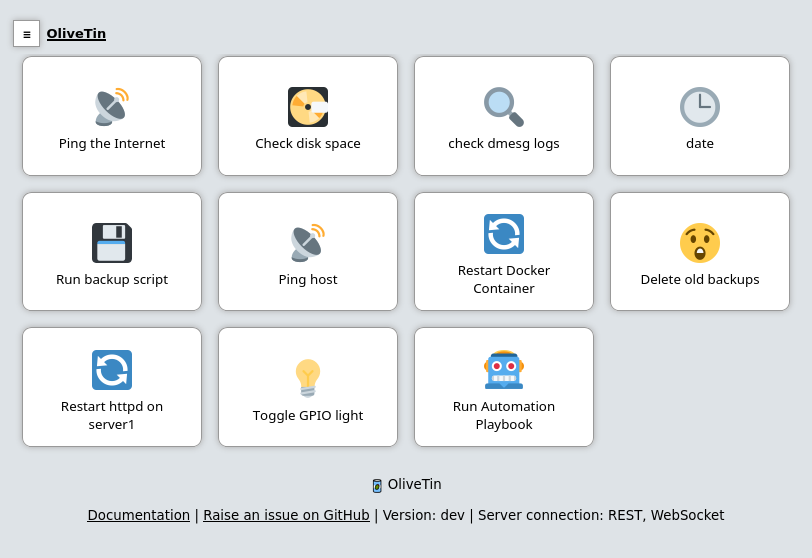

<!--
Ohart ongi: README hau automatikoki sortu da <https://github.com/YunoHost/apps/tree/master/tools/readme_generator>ri esker
EZ editatu eskuz.
-->

# OliveTin YunoHost-erako

[](https://ci-apps.yunohost.org/ci/apps/olivetin/)


[](https://install-app.yunohost.org/?app=olivetin)

*[Irakurri README hau beste hizkuntzatan.](./ALL_README.md)*

> *Pakete honek OliveTin YunoHost zerbitzari batean azkar eta zailtasunik gabe instalatzea ahalbidetzen dizu.*  
> *YunoHost ez baduzu, kontsultatu [gida](https://yunohost.org/install) nola instalatu ikasteko.*

## Aurreikuspena

OliveTin gives safe and simple access to predefined shell commands from a web interface.

## Use cases
###  Safely give access to commands, for less technical people

- Give your family a button to `systemctl restart jellyfin`
- Give junior admins a simple web form with dropdowns, to start your custom script like `backupScript.sh --folder {{ customerName }}`
- Enable SSH access to the server for the next 20 mins `firewall-cmd --add-service ssh --timeout 20m`

### Simplify complex commands, make them accessible and repeatable

- Expose complex commands on touchscreen tablets stuck on walls around your house. `wake-on-lan aa:bb:cc:11:22:33`
- Run long running on your servers from your cell phone. `apt upgrade -y`

## Features

- Responsive, touch-friendly UI - great for tablets and mobile
- Super simple config in YAML - because if it’s not YAML now-a-days, it’s not "cloud native" :-)
- Dark mode - for those of you that roll that way.
- Accessible - passes all the accessibility checks in Firefox, and issues with accessibility are taken seriously.
- Container - available for quickly testing and getting it up and running, great for the selfhosted community.
- Integrate with anything - OliveTin just runs Linux shell commands, so theoretially you could integrate with a bunch of stuff just by using curl, ping, etc. However, writing your own shell scripts is a reat way to extend OliveTin.
- Lightweight on resources - uses only a few MB of RAM and barely any CPU. Written in Go, with a web interface written as a modern, responsive, Single Page App that uses the REST/gRPC API.
- Good amount of unit tests and style checks - helps potential contributors be consistent, and helps with maintainability.


**Paketatutako bertsioa:** 2025.3.28~ynh1

## Pantaila-argazkiak



## Dokumentazioa eta baliabideak

- Aplikazioaren webgune ofiziala: <https://www.olivetin.app>
- Administratzaileen dokumentazio ofiziala: <https://docs.olivetin.app>
- Jatorrizko aplikazioaren kode-gordailua: <https://github.com/OliveTin/OliveTin>
- YunoHost Denda: <https://apps.yunohost.org/app/olivetin>
- Eman errore baten berri: <https://github.com/YunoHost-Apps/olivetin_ynh/issues>

## Garatzaileentzako informazioa

Bidali `pull request`a [`testing` abarrera](https://github.com/YunoHost-Apps/olivetin_ynh/tree/testing).

`testing` abarra probatzeko, honakoa egin:

```bash
sudo yunohost app install https://github.com/YunoHost-Apps/olivetin_ynh/tree/testing --debug
edo
sudo yunohost app upgrade olivetin -u https://github.com/YunoHost-Apps/olivetin_ynh/tree/testing --debug
```

**Informazio gehiago aplikazioaren paketatzeari buruz:** <https://yunohost.org/packaging_apps>
